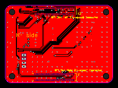
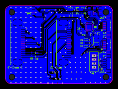

# SimuSound Connector PCB

A carrier board for the Raspberry Pi Compute Module 4. Same outline as the CM4, has 2x MIPI connectors, ICM-20689 IMU, 1x USB via 1mm JST connector, various GPIOs (1mm JST connectors), various test points. PCB file is in EasyEDA format.

https://oshwlab.com/shyprea2/simusound-pcbs

# TODO

- SCL1/SDA1 and SDL0/SDA0 should be swapped
- USB_OTG_ID should be grounded
- USB is extremely unreliable, should not be routed underneath the 100-pin connector
- Differential pairs (MIPI/USB) should be length matched more accurately
- USB via 1mm JST not the best method
